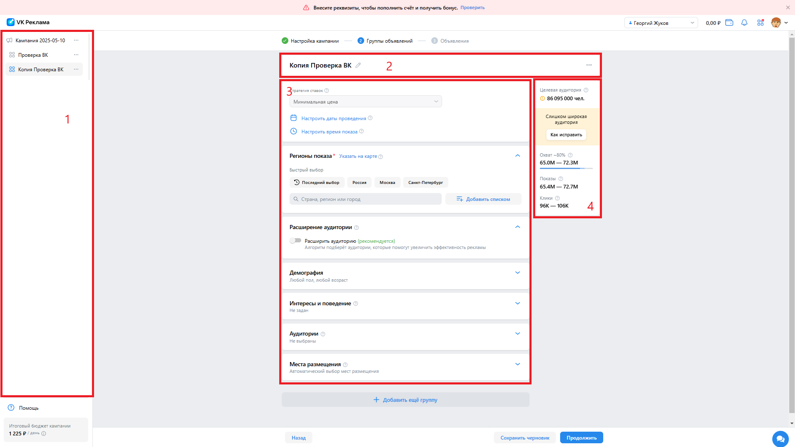
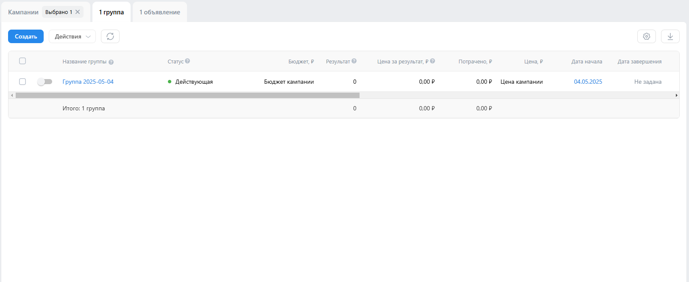
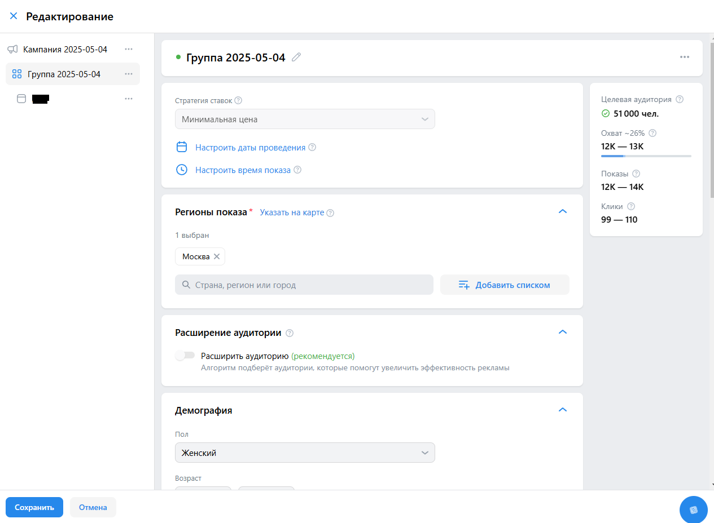
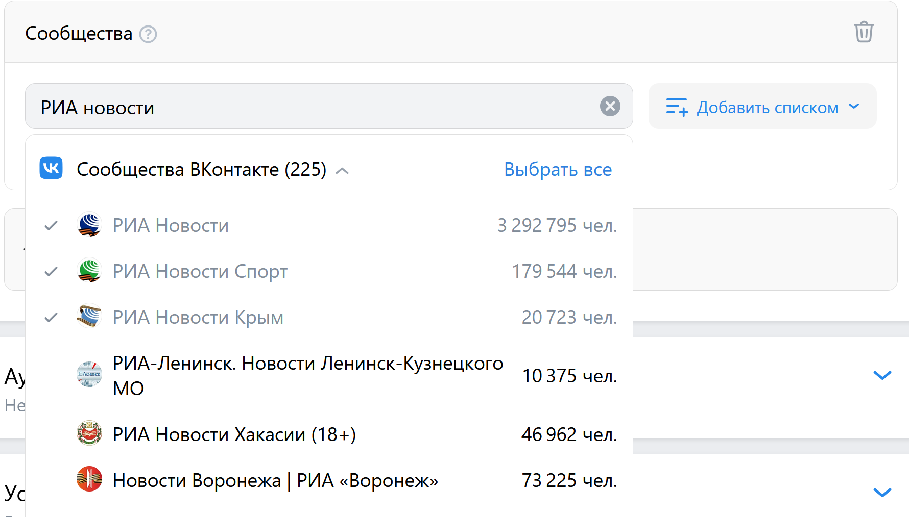

# Команда РПО, ДЗ №3

# Оглавление

1. [Создание кампании](#1-создание-кампании)
2. [Редактирование и просмотр кампании](#2-редактирование-и-просмотр-кампании)
3. [Создание группы](#3-создание-группы)
4. [Редактирование и просмотр группы](#4-редактирование-и-просмотр-группы)
5. [Создание объявления](#5-создание-объявления)
6. [Редактирование объявления](#6-редактирование-объявления)
7. [Предпросмотр объявлений](#7-предпросмотр-объявлений)
8. [Создание аудитории](#8-создание-аудитории)
9. [Баги](#9-баги)

## 1. Создание кампании

Поддерживаемый формат ввода указан тут: https://ads.vk.com/help/articles/formats  

- [ ] При нажатии на название кампании можно отредактировать название кампании
- [ ] При вводе текста в поле названия, превышающего допустимый размер, ввод текста блокируется
- [ ] При редактировании названия после нажатия на иконку галочки изменения сохраняются
- [ ] При выборе целевой аудитории корректно рендерится блок с анкетой для дополнительной информации
- [ ] При вводе невалидных ссылок ("aaaaaa") выводит ошибку
- [ ] При выборе данных о узнаваемости и охвате рендерится блок с анкетой для дополнительной информации
- [ ] При вводе данных о узнаваемости и охвате соблюдаются все правила валидации по длине и используемым символам
- [ ] При составлении смарт-кампании при вводе невалидной ссылки в поле "Рекламируемый объект" выводится ошибка
- [ ] При вводе корректной ссылки в поле "Рекламируемый объект" при составлении смарт-кампании
- [ ] После успешного добавления ссылки рендерится поле для ввода описания предложения
- [ ] При вводе данных превышающих объем в 300 символов дальнейший ввод данных блокируется
- [ ] При нажатии на кнопку продолжить производится переход на страницу редактирования кампании, если нет ошибок в введенных данных
- [ ] При нажатии на кнопку продолжить не производится переход на страницу редактирования кампании, если есть ошибки в введенных данных, и появляется кнопка с количеством ошибок
- [ ] При наведении на кнопку с ошибками всплывает подсказка с указанием ошибок

## 2. Редактирование и просмотр кампании

- [ ] При нажатии на название кампании можно отредактировать название кампании
- [ ] При нажатии на поле для ввода ссылки на "Рекламируемый сайт/объект" нельзя изменить ссылку
- [ ] При нажатии на кнопку "Открыть в новой вкладке" происходит переход по ссылке
- [ ] При нажатии на поле для ввода "Важных деталей и отличий от конкурентов" нельзя отредактировать введенные ранее данные
- [ ] При наведении мыши на значок "Вопрос" рядом с "Рекламируемый сайт" отображается вспомогательная информация
- [ ] При наведении мыши на значок "Вопрос" рядом с "Важные детали и отличия от конкурентов" отображается вспомогательная информация
- [ ] При нажатии на ссылку в всплывающем окне, при наведении мыши на значок "Вопрос" рядом с "Рекламируемый сайт", происходит переход по ссылке
- [ ] При нажатии на поле "Целевое действие" нельзя выбрать другой вариант
- [ ] При наведении мыши на значок "Вопрос" рядом с "Целевое действие" отображается вспомогательная информация
- [ ] При нажатии на ссылку в всплывающем окне, при наведении мыши на значок "Вопрос" рядом с "Целевое действие", происходит переход по ссылке
- [ ] При нажатии на чекбокс рядом с надписью "Учитывать офлайн-конверсии" он окрашивается в синий цвет
- [ ] При наведении мыши на значок "Вопрос" рядом с "Учитывать офлайн-конверсии" отображается вспомогательная информация
- [ ] При нажатии на ссылку в всплывающем окне, при наведении мыши на значок "Вопрос" рядом с "Учитывать офлайн-конверсии", происходит переход по ссылке
- [ ] При нажатии на поле "Стратегия ставок" можно изменить ранее выбранный вариант
- [ ] При выборе в "Стратегии ставок" "Предельная цена" появляется поле "Макс. стоимость клика"
- [ ] При наведении мыши на значок "Стратегии ставок" рядом с "Учитывать офлайн-конверсии" отображается вспомогательная информация
- [ ] При нажатии на поле "Макс. стоимость клика" можно ввести цену
- [ ] При наведении мыши на значок "Вопрос" рядом с "Макс. стоимость клика" отображается вспомогательная информация
- [ ] При нажатии на ссылку в всплывающем окне, при наведении мыши на значок "Вопрос" рядом с "Макс. стоимость клика", происходит переход по ссылке
- [ ] При наведении мыши на значок "Вопрос" рядом с "Бюджет" отображается вспомогательная информация
- [ ] При нажатии на ссылку в всплывающем окне, при наведении мыши на значок "Вопрос" рядом с "Бюджет", происходит переход по ссылке
- [ ] При нажатии на поле "Бюджет" можно ввести другое число
- [ ] При нажатии на поле "за день" можно выбрать "за всё время" и наоборот
- [ ] При нажатии на левое поле в блоке "Дата проведения" можно изменить начало кампании
- [ ] При нажатии на правое поле в блоке "Дата проведения" можно изменить конец кампании
- [ ] При наведении мыши на значок "Вопрос" рядом с "Даты проведения" отображается вспомогательная информация
- [ ] При нажатии на кнопку "Сохранить" применяются все изменения

## 3. Создание группы

**Основные блоки страницы**

1. Дерево
2. Секция с названием группы
3. Настройки группы
4. Расчёт целевой аудитории

### Изменение названия

- [ ] По умолчанию группа называется `Группа ГГГГ-ММ-ДД`
- [ ] При нажатии на название группы это название становится input-ом, текст в нём полностью выделяется
- [ ] После введения другого названия и потери фокуса новое название сохраняется; проверить можно перезагрузкой страницы
- [ ] После изменения названия это название обновляется в дереве

### Настройки целевой аудитории

То, что расчёт целевой аудитории обновился, предлагается узнавать по тому, что изменяется показатель "Целевая аудитория" в блоке "Расчёт целевой аудитории".
Таймаут ожидания обновления - 3 секунды.

#### Регионы показа

- [ ] При выборе пункта "Москва" расчёт обновляется
- [ ] При вводе "Санкт-Петербург" в поле поиска появляется единственная строка с результатом поиска
- [ ] При нажатии на эту единственную строку расчёт обновляется
- [ ] При удалении региона расчёт обновляется
- [ ] При нажатии на кнопку "Добавить списком" открывается модальное окно, фокус устанавливается на TextArea
- [ ] При вводе нескольких городов в список и нажатии кнопки "Добавить" расчёт обновляется
- [ ] При загрузке списка из файла расчёт обновляется

#### Демография

- [ ] При изменении пола расчёт обновляется
- [ ] При изменении возрастных рамок расчёт обновляется
- [ ] При выборе возрастной маркировки "18+" и установке минимального возраста ЦА "12 лет" выдаётся предупреждение "Указанный возраст меньше выставленной маркировки"

#### Интересы и поведение

- [ ] При нажатии на карточку "Интересы" открываются настройки интересов
- [ ] При нажатии на карточку "Ключевые фразы" открываются настройки ключевых фраз
- [ ] При нажатии на карточку "Сообщества" открываются настройки сообществ
- [ ] При нажатии на карточку "Музыканты" открываются настройки музыкантов

**Интересы**

- [ ] При нажатии на Select список открывается
- [ ] При выборе одного пункта расчёт обновляется, также появляется бейджик
- [ ] При выборе нескольких пунктов расчёт обновляется
- [ ] При удалении пункта удаляется бейджик и обновляется расчёт

Настройки остальных пунктов доступны только при создании аудитории, поэтому тестируются не здесь

**Аудитории**

Предусловия: должна быть создана хотя бы одна аудитория

- [ ] При нажатии на Select раскрывается список
- [ ] При нажатии на элемент этого списка обновляется расчёт
- [ ] При повторном нажатии на элемент расчёт снова обновляется

**Устройства**

- [ ] При развертывании блока "Устройства" отображаются чекбоксы "Мобильные" и "Десктопные"
- [ ] При нажатии на "Мобильные" происходит снятие птички, расчёт обновляется
- [ ] После нажатия на "Мобильные" флажок "Десктопные" стал выключенным
- [ ] При нажатии на "Десктопные" (при отключенных мобильных) расчёт не обновляется
- [ ] При повторном нажатии на "Мобильные" расчёт обновляется

## 4. Редактирование и просмотр группы

- [ ] При наведении на строку с группой появляется иконка с карандашиком
- [ ] При нажатии на иконку открывается Sidebar

### Изменение названия

- [ ] При нажатии на название группы это название становится input-ом, текст в нём полностью выделяется
- [ ] После введения другого названия и потери фокуса новое название сохраняется; проверить можно перезагрузкой страницы
- [ ] После изменения названия это название обновляется в дереве

### Отмена без сохранения

- [ ] При клике вне сайдбара при отсутствии изменений

### Отмена и сохранение

Предусловие: добавить город "Москва" в группу (чтобы сделать изменение)

- [ ] При нажатии вне сайдбара появляется модальное окно с надписью "Сохранить изменения?"
- [ ] При нажатии вне окна это окно закрывается
- [ ] При нажатии на кнопку "Отмена" появляется такое же модальное окно
- [ ] При нажатии на кнопку "Сохранить" в сайдбаре он закрывается

## 5. Создание объявления

Отмена выделения

 

- [x] Если в поисковую строку для нахождения сообществ по названию ввести текст, затем отметить интересующие поля, то выбранные сообщества отметятся светло-серой галочкой, но если потом обратно кликнуть на текстовое поле, выделение пропадает

### 3. Настройка объявления

**Основные блоки страницы**

1. Логотип и заголовок
2. Описание и ссылка
3. Кнопка призыва
4. Медиафайлы (карусель, галерея)

- [ ] При загрузке логотипа в формате JPG размером больше 100x100 px изображение отображается в превью
- [ ] При вводе заголовка "Стулья" он отображается в превью и проходит валидацию
- [ ] При вводе описания "Продаём стулья из красного дерева" текст отображается на карточке объявления
- [ ] В поле "Ссылка на сайт" подставляется адрес, указанный на предыдущем шаге
- [ ] При выборе кнопки "Заказать" надпись изменяется в превью
- [ ] При загрузке изображения в блок "Медиафайлы" предлагаются опции обрезки и анимации
- [ ] При выборе пятого слайда в карусели превью обновляется соответствующим изображением
- [ ] При нажатии "Добавить ещё формат", выборе "Галерея" и загрузке 2 изображений — они отображаются в режиме "Слайдер"

### 4. Финализация и ИНН

- [ ] При нажатии "Опубликовать" появляется окно для ввода ИНН
- [ ] При вводе ИНН короче 12 символов (например, "123") отображается ошибка "Длина ИНН должна быть 12 символов"
- [ ] При вводе недопустимых символов (например, "$2@-") отображается ошибка "Некорректный ИНН"
- [ ] При закрытии окна ИНН данные объявления остаются без изменений
- [ ] При нажатии "Сохранить черновик" отображается уведомление "Изменения сохранены"

## 6. Редактирование объявления

Поддерживаемый формат ввода указан тут: https://ads.vk.com/help/articles/formats

- [ ] При вводе описания предложения текст отображается
- [ ] При вводе больше 300 символов в поле описания предложения ввод текста блокируется
- [ ] После редактирования описания предложения появляются кнопки "Отменить", "Сохранить"
- [ ] При нажатии на кнопку "Отменить" изменения сбрасываются
- [ ] При нажатии на кнопку "Сохранить" изменненное предложение сохраняется и запускается генерация возможных заголовков, изображений и описаний объявления
- [ ] При нажатии на кнопку "Заменить" для замены логотипа открывается всплывашка "Медиатека"
  - [ ] При загрузке файлов, соответствующих требованиям, картинка отображается в списке
  - [ ] Поддерживается загрузка только форматов PNG, JPEG, ZIP(должен содержать HTML), MP4, MOV
  - [ ] При загрузке данных превышающих допустимый размер выводится ошибка
  - [ ] При загрузке ZIP файлов производится распаковка HTML-файла и валидация содержимого
  - [ ] При загрузке ZIP файла с некорректным содержимым выводится соответствующая ошибка
  - [ ] Производится переключение между вкладками "Изображения", "Видео", "Из сообщества", "Созданные нейросетью" с корректным отображением сответствующих картинок
- [ ] При нажатии на иконку "Обрезать" открывается окно, где есть кнопки "Отменить", "Сохранить"
  - [ ] При нажатии на кнопку "Отменить" изменения отменяются
  - [ ] Соблюдается ограничения минимально возможного размера, то есть пользователь не может обрезать фото так, чтобы оно было меньше минимума
  - [ ] При нажатии на кнопку "Применить" открывается окно с предпросмотром изменений с кнопками "Отменить", "Сохранить", "К оригиналу"
    - [ ] При нажатии на кнопку "К оригиналу" откроется окно с редактированием исходного изображения
    - [ ] При нажатии на кнопку "Отменить" изменения отменяются
    - [ ] При нажатии на кнопку "Сохранить" изменения вступают в силу
- [ ] При вводе описания объявления текст отображается
- [ ] При вводе больше 2000 символов в поле описания объявления ввод текста блокируется
- [ ] При вводе некорректных символов выводится сообщение об ошибке, некорректный символ подсвечивается
- [ ] При нажатии на иконку для просмотра вариантов от нейросети открывается окно, где есть 3 варианта описания объявления и кнопки "Изменить запрос", "Сгенерировать ещё"
  - [ ] При нажатии на кнопку "Изменить запрос" открывается поле редактирования с текстом описания предложения и кнопки "Отмена", "Применить"
    - [ ] При изменении запроса при вводе запроса свыше 300 символов ввод новых символов блокируется
    - [ ] При нажатии на кнопку "Отмена" изменения отменяются
    - [ ] При нажатии на кнопку "Применить" запускается генерация новых вариантов заголовка и описания объявления
  - [ ] При нажатии на кнопку "Сгенерировать еще" генерируются 3 новых описания объявления
  - [ ] После генерации 15 описаний объявления кнопка "Сгенерировать еще" блокируется и при наведении на эту кнопку всплывает подсказка, предлагающая изменить запрос
- [ ] При нажатии на изображение в разделе Изображения открывается окно, где есть кнопки "Отменить", "Сохранить", "Дорисовать изображение" и можно отредактировать размеры изображения
  - [ ] При нажатии на кнопку "Отменить" изменения отменяются
  - [ ] Соблюдается ограничения минимально возможного размера, то есть пользователь не может обрезать фото так, чтобы оно было меньше минимума
  - [ ] При нажатии на кнопку "Применить" открывается окно с предпросмотром изменений с кнопками "Отменить", "Сохранить", "К оригиналу"
    - [ ] При нажатии на кнопку "К оригиналу" откроется окно с редактированием исходного изображения
    - [ ] При нажатии на кнопку "Отменить" изменения отменяются
    - [ ] При нажатии на кнопку "Сохранить" изменения вступают в силу
  - [ ] При нажатии на кнопку "Дорисовать изображение" открывается окно с текущей картинкой и сгенерированной новой, есть кнопки "Оставить текущий вариант", "Применить новый вариант", и иконка для генерации нового изображения
    - [ ] При нажатии на кнопку "Оставить текущий вариант" изменения отменяются
    - [ ] При нажатии на кнопку "Применить новый вариант" старая картинка заменяется новой
    - [ ] При нажатии на иконку генерации нового изображения генерируется новое изображение
- [ ] При нажатии на видео в разделе "Видео" открывается окно с вопроизведением данного видео
- [ ] При нажатии на кнопку "Добавить еще формат" всплывает меню с пунктами "Карусель слайдов", "Галерия медиафайлов"
- [ ] При нажатии на кнопку "Карусель слайдов" добавлется раздел с редактированием карусели слайдов
  - [ ] Поддерживается ограничение максимум 6 слайдов, кнопка "Добавить слайд" исчезает после добавления 6 слайдов
  - [ ] Поддерживаэтся ограничения на размер и формат загружаемой картинки в соответствии с правилами 
  - [ ] При вводе некорректного ввода(превышение допустимого объема или недопустимые символы) в поле заголовка выводится соответствующее сообщение об ошибке
  - [ ] При вводе некорректного ввода(превышение допустимого объема или недопустимые символы) в поле описания слайда выводится соответствующее сообщение об ошибке
- [ ] Поддерживается ограничения вводимого текста в разделе "О рекламодателе"
- [ ] В разделе "Возрастная маркировка" выпадет меню с выбором вариантов
- [ ] Проставляется чекбокс в разделе "Социальная реклама"

## 7. Предпросмотр объявлений

- [ ] При наведении мыши на значок "Вопрос" рядом с "Предпросмотр" отображается вспомогательная информация
- [ ] При нажатии на кнопку "Пост" объявление отображается в виде поста
- [ ] При нажатии на кнопку "В колонке" объявление отображается в колонке
- [ ] При нажатии на кнопку "Полноэкранный блок" объявление отображается в виде полноэкранного блока
- [ ] При нажатии на кнопку "Нативный блок" объявление отображается в виде нативного блока
- [ ] При нажатии на кнопку "Ролик в видео" объявление отображается в виде ролика в видео
- [ ] При наведении мыши на объявление проигрывается сгенерированное видео
- [ ] При нажатии на правую кнопку рядом с объявлением происходит переключение на следующий режим отображения
- [ ] При нажатии на левую кнопку рядом с объявлением происходит переключение на предыдущий режим отображения
- [ ] При недостаточном балансе при нажатии на кнопку «Посмотреть на площадке» переход к объявлению невозможен
- [ ] При достаточном балансе при нажатии на кнопку «Посмотреть на площадке» переход к объявлению возможен
- [ ] При наведении мыши на значок "Вопрос" рядом с "Пост" отображается вспомогательная информация
- [ ] При наведении мыши на значок "Вопрос" рядом с "В колонке" отображается вспомогательная информация
- [ ] При наведении мыши на значок "Вопрос" рядом с "Полноэкранный блок" отображается вспомогательная информация
- [ ] При наведении мыши на значок "Вопрос" рядом с "Нативный блок" отображается вспомогательная информация
- [ ] При наведении мыши на значок "Вопрос" рядом с "Ролик в видео" отображается вспомогательная информация

## 8. Создание аудитории

### 1. Общие проверки

- [ ] При переходе в раздел "Аудитории" отображается заглушка с кнопкой "Создать аудиторию", справочной ссылкой и меню дополнительных действий
- [ ] При нажатии "Создать аудиторию" открывается форма с полем ввода названия и кнопками добавления/исключения источников
- [ ] При вводе уникального названия до 255 символов ввод сохраняется, отображается счётчик символов
- [ ] При оставленном пустым поле названия кнопка "Сохранить" отключена или отображается предупреждение
- [ ] При вводе названия длиннее 255 символов появляется ошибка "Максимальная длина 255 символов", поле подсвечивается
- [ ] При нажатии "Сохранить" без добавления источников отображается предупреждение об обязательности хотя бы одного источника
- [ ] При нажатии "Отмена" происходит возврат к предыдущему экрану, аудитория не создается
- [ ] При попытке закрыть окно с несохранёнными изменениями отображается диалог подтверждения отмены

### 2. Работа с источниками

- [ ] При нажатии "Добавить источник" открывается меню с категориями: "Списки", "Поведение", "Интересы"
- [ ] При нажатии "Исключить источник" открывается аналогичное меню исключения
- [ ] При добавлении и исключении одного и того же источника появляется ошибка о невозможности дублирования
- [ ] При выборе источника "Категории мобильных приложений" отображаются обязательные поля и источник успешно сохраняется
- [ ] При удалении источника отображается окно подтверждения удаления

### 3. Проверки с различными источниками

- [ ] При добавлении пользователей из сообщества вручную источник сохраняется, пользователь возвращается к форме
- [ ] При загрузке списка пользователей (CSV или TXT) валидные строки обрабатываются, ошибки отображаются
- [ ] При добавлении источника "События в рекламной кампании" и корректных данных источник сохраняется
- [ ] При добавлении источника "Музыканты" исполнители добавляются успешно, возвращение к созданию
- [ ] При исключении пользователей, открывших лид-форму, источник применяется, отображаются данные

### 4. Негативные сценарии

- [ ] При загрузке пустого файла появляется сообщение об ошибке: "Файл пуст"
- [ ] При вводе ID сообщества с ошибкой в формате источник не добавляется, появляется предупреждение
- [ ] При выборе источника, требующего настройки (например, пиксель не подключен), появляется сообщение о необходимости предварительной настройки

### 5. Действия после создания

- [ ] После создания аудитория отображается в списке с корректным названием, типом, охватом, ID и датой создания
- [ ] Поиск по названию работает корректно, ошибки отображаются при вводе длинных строк
- [ ] При удалении аудитории через меню появляется подтверждение, после чего элемент исчезает из списка
- [ ] При использовании массовых действий (удалить, поделиться) подсказки отображаются при наведении, действия применяются только к выбранным аудиториям

### 6. Доступ и совместная работа

- [ ] При настройке доступа открывается меню с полем для ввода ID рекламных кабинетов
- [ ] При попытке сохранить доступ без заполнения всех полей отображается сообщение "Нужно заполнить", поля подсвечиваются
- [ ] После успешного сохранения появляется ссылка для внешнего доступа, её можно передать другим пользователям

### 7. Навигация и UX

- [ ] Фильтры по категориям источников работают корректно, выбранные категории отображаются
- [ ] В кебаб-меню аудитории доступны действия "Редактировать", "Удалить", "Настроить доступ"
- [ ] Горизонтальный и вертикальный скролл в списке аудиторий работает, все поля отображаются
- [ ] Интерфейс корректно отображается при уменьшении ширины экрана (адаптивность)
- [ ] Во всех проверенных браузерах (Chrome, Firefox, Safari) интерфейс и функциональность одинаковы

### 8. Дополнительно: вкладка "Списки пользователей"

- [ ] При переходе на вкладку отображается кнопка "Загрузить список", справка и кебаб-меню
- [ ] При загрузке корректного списка он появляется в таблице с датой, охватом и статусом
- [ ] При настройке доступа открывается окно с возможностью ввода ID кабинетов для предоставления доступа

### 9. Дополнительно: вкладка "Офлайн-конверсии"

- [ ] При открытии раздела отображается кнопка "Создать список", справка и таблица списков (если они есть)
- [ ] При загрузке списка офлайн-конверсий проходит валидация, данные отображаются корректно

## 9. Баги

Баг - генерация объявлений с некорректными символами  
Шаги воспроизведения:  

- Ввести в окно с описанием предложения, которое соддержит некорректные символы(например, иероглифы 银行)  
- Нажать на кнопку "Вариант от нейросети"  

Ожидаемый результат: ошибка »вывод ошибки на этапе формулирования предложения  
Фактический результат: генерация объявления с неподдерживаемыми символами  
  

[Отмена выделения](#отмена-выделения)
