# Чек-лист
## Команда [SaraFun]
### Проект [ads.vk.com](https://ads.vk.com)

---

### [Создание опроса](https://ads.vk.com)
#### Авторизация требуется
1. Оформление:
    * [ ] Создание опроса. Ввести название компании длиннее 30 символов. Проверить, что отображается ошибка: "Сократите текст"
    - 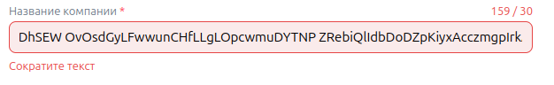
    * [ ] Создание опроса. Ввести заголовок опроса длиннее 50 символов. Проверить, что отображается ошибка: "Сократите текст"
    - 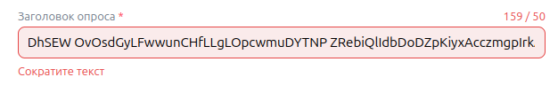
    * [ ] Создание опроса. Ввести описание формы длиннее 350 символов. Проверить, что отображается ошибка: "Сократите текст"
    - 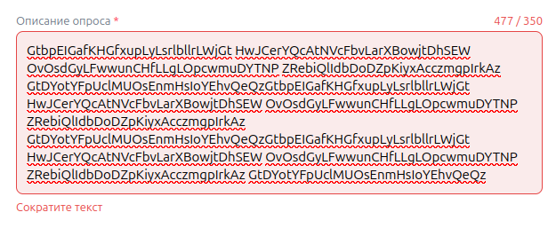
    * [ ] Создание опроса. Ввести пустое поле названия компании. Проверить, что отображается ошибка: "Нужно заполнить"
    - 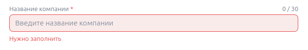
    * [ ] Создание опроса. Ввести пустое поле заголовок опроса. Проверить, что отображается ошибка: "Нужно заполнить"
    - 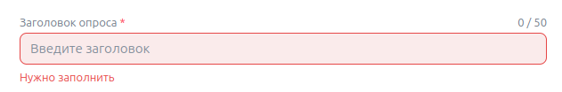
    * [ ] Создание опроса. Ввести пустое поле описание опроса. Проверить, что отображается ошибка: "Нужно заполнить"
    - 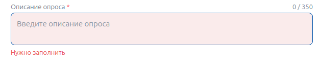
     * [ ] Создание опроса. Загрузить в логотип файл больше 300кб. Проверить, что отображается ошибка: "Файл не был загружен"
    - 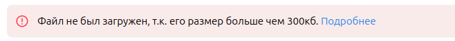
    * [ ] Создание опроса. При получении ошибки на следующий этап перейти нельзя
    * [ ] Создание опроса. При успешной загрузки логотипа, он появляется в карточке, его можно изменить
    - 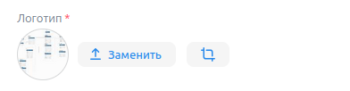
    * [ ] Создание опроса. При выборе стиля карточки она изменяется в соответствующий цвет
    * [ ] Создание опроса. При смене с мобильной на десктопную версию превью меняется под соответсвующий формат

2. Вопросы:
    * [ ] Создание опроса. Ввести пустое значние в текст вопроса. Проверить, что отображается ошибка: "Вопрос не может быть пустым и должен содержать минимум два ответа"
    * [ ] Создание опроса. Ввести пустое значние в ответ вопроса. Проверить, что отображается ошибка: "Вопрос не может быть пустым и должен содержать минимум два ответа"
    - 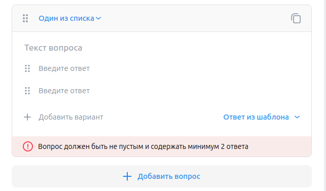

    * [ ] Создание опроса. Ввести пустое значение в "содержит любой из". Проверить, что отображается ошибка: "Нужно заполнить все поля"
    * [ ] Создание опроса. Ввести пустое значение в "заголовок экрана". Проверить, что отображается ошибка: "Нужно заполнить все поля"
    * [ ] Создание опроса. Ввести пустое значение в "описание". Проверить, что отображается ошибка: "Нужно заполнить все поля"
    - 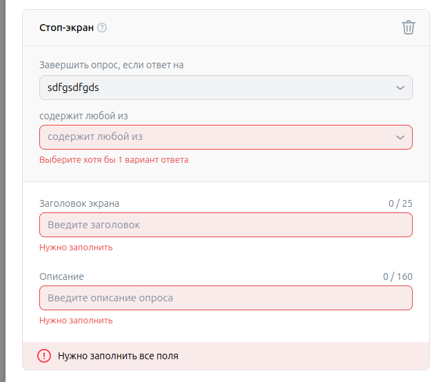

3. Результат:
   * [ ] Создание опроса. Ввести пустое значение в поле "Заголовок". Проверить, что нельзя перейти на следующий этап и отображается ошибка: "Нужно заполнить"
   * [ ] Создание опроса. Ввести пустое значение в поле "Описание". Проверить, что нельзя перейти на следующий этап и отображается ошибка: "Нужно заполнить"
   - 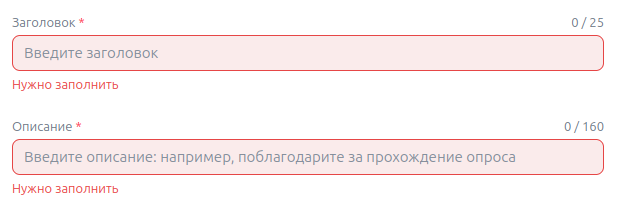
   * [ ] Создание опроса. Запустить опрос, не имея ИНН и денег на аккаунте. Проверить, что появляется ошибка с соответствующим уведомлением
   - 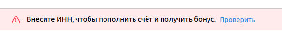
   * [ ] Создание опроса. Ввести количество респондентов, меньшее 10. Проверить, что появляется ошибка: "Количество респондентов должно быть больше 10"
   * [ ] Создание опроса. Ввести значение, меньшее 100 рублей в поле бюджет. Проверить, что появляется ошибка: "Укажите бюджет не меньше 100 рублей"
   - 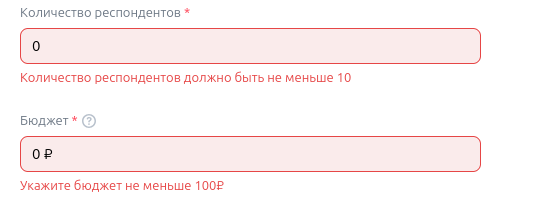

