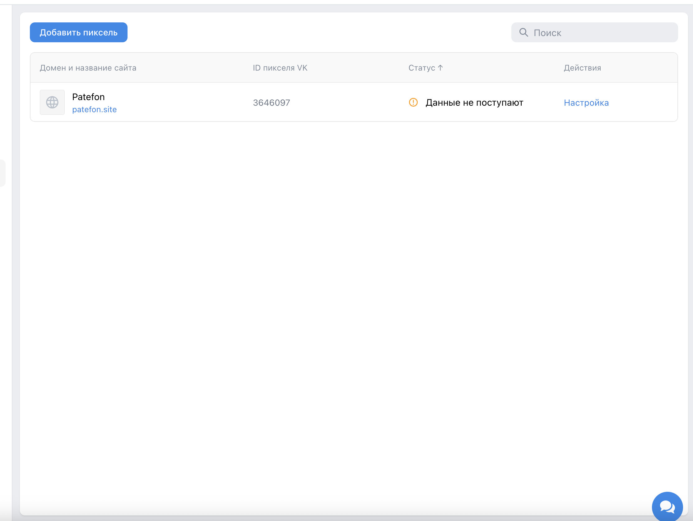
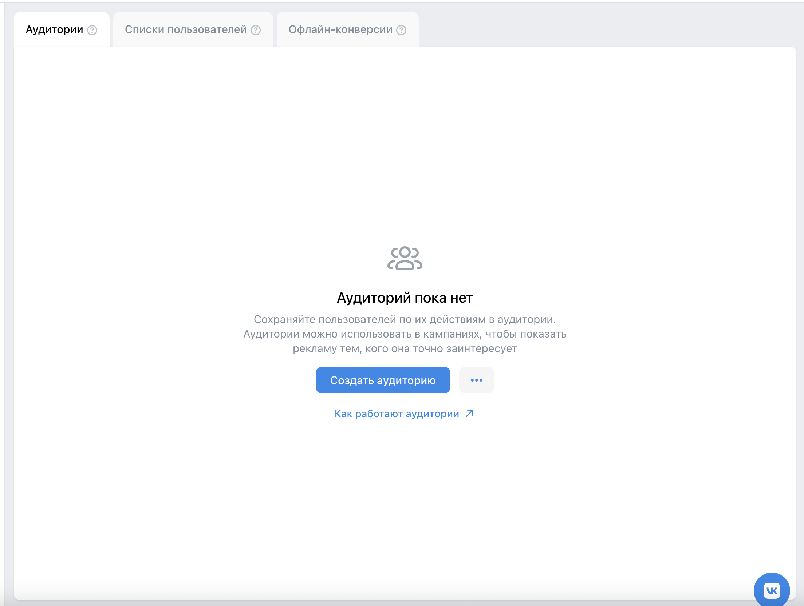
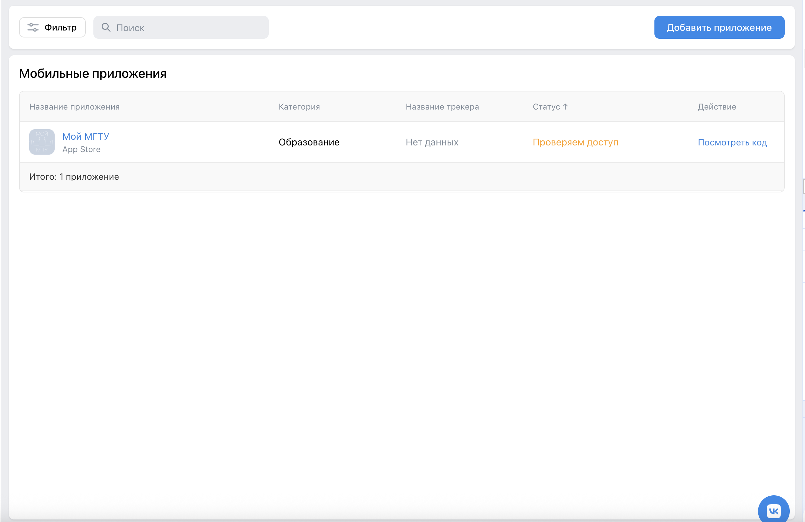

# Сайты

Ссылка: https://ads.vk.com/hq/pixels

## Добавление пикселя

- При нажатии на кнопку "Создать пиксель" открывается диалоговое окно.

**Позитивные кейсы:**

- При вводе в инпут домена строки "patefon.site" и нажатии кнопки "Добавить пиксель", открывается следующее диалоговое окно. Создаем пиксель для данного сайта, показывается ID созданного пикселя.
  Проверяем в списке пикселей, что создан пиксель с данным ID, названием "Patefon", доменом "patefon.site".

- При вводе в инпут домена строки "bmstu.ru" и нажатии кнопки "Добавить пиксель", открывается следующее диалоговое окно. Создаем пиксель для данного сайта, показывается ID созданного пикселя.
  Проверяем в списке пикселей, что создан пиксель с данным ID, названием "bmstu.ru", доменом "bmstu.ru".

- При вводе в инпут домена строки "github.com" и нажатии кнопки "Добавить пиксель", открывается следующее диалоговое окно. Создаем пиксель для данного сайта, показывается ID созданного пикселя.
  Проверяем в списке пикселей, что создан пиксель с данным ID, названием "GitHub Build and ship softwa", доменом "github.com".

- При вводе в инпут домена строки "https://www.gosuslugi.ru/" и нажатии кнопки "Добавить пиксель", открывается следующее диалоговое окно. Создаем пиксель для данного сайта, показывается ID созданного пикселя.
  Проверяем в списке пикселей, что создан пиксель с данным ID, названием "Портал государственных услуг Р", доменом "gosuslugi.ru".

- При вводе в инпут домена строки "tilda.cc" и нажатии кнопки "Добавить пиксель", открывается следующее диалоговое окно. Создаем пиксель для данного сайта, показывается ID созданного пикселя.
  Проверяем в списке пикселей, что создан пиксель с данным ID, названием "Создать сайт бесплатно конст", доменом "tilda.cc".

**Негативные кейсы:**

- При вводе в инпут домена строки "" и кнопка "Добавить пиксель" некликабельна.

- При вводе в инпут домена строки "фапфпфыпфыпфы" и нажатии на кнопку "Добавить пиксель", возникает ошибка.

- При вводе в инпут домена строки "123.123" и нажатии на кнопку "Добавить пиксель", возникает ошибка.

- При вводе в инпут домена строки "!@#mail!@#.@!ru" и нажатии на кнопку "Добавить пиксель", возникает ошибка.

# Аудитории

Ссылка: https://ads.vk.com/hq/audience

## Создание аудитории

- При нажатии на кнопку "Создать аудиторию" открывается модальное окно.

`Предварительно создаем пиксель Patefon для сайта patefon.site`

### Источники

- При нажатии на кнопку "Добавить источник" открывается модальное окно. Проверить наличие тега "Добавить источник".

#### События на сайте

- При нажатии на кнопку "События на сайте" открывается модальное окно. Проверить наличие тега "События на сайте". Проверить наличие "Patefon" в инпуте выбранного пикселя.

- При нажатии на свитч "Посещение сайта" появляется инпут периода.

**Позитивные кейсы:**

- При введенных от "0" до "365" можно сохранить источник.
  Проверяем, что созданный источник имееn событие с корректным ID пикселя, названием "Patefon" и периодом "Посещение сайта (0 - 365)".

- При введенных от "12566" - от сбрасывается до "365".
  Проверяем, что созданный источник имееn событие с корректным ID пикселя, названием "Patefon" и периодом "Посещение сайта (365 - 365)".

- При введенных от "20" до "20" и попытке ввести до "0" - до сбрасывается до "20".
  Проверяем, что созданный источник имееn событие с корректным ID пикселя, названием "Patefon" и периодом "Посещение сайта (20 - 20)".

**Негативные кейсы:**

- Символы a, b, c, а, б, в не вписываются в инпут - написать можно только цифры.

- При отключенном свитче "Посещение сайта" сохранить источник нельзя.

### Название аудитории

**Позитивные кейсы:**

- При вводе в инпут названия аудитории "" и нажатии кнопки "Сохранить", модальное окно закрывается. Проверить наличие в списке аудиторий созданной аудитории с названием текущей даты (например, "Аудитория 2025-05-28"). Проверить, что дата создания аудитории совпадает с текущей.

- При вводе в инпут названия аудитории "Аудитория EaglesDesigners123" и нажатии кнопки "Сохранить", модальное окно закрывается. Проверить наличие в списке аудиторий созданной аудитории с названием "Аудитория EaglesDesigners123". Проверить, что дата создания аудитории совпадает с текущей.

- При вводе в инпут названия аудитории "!!!!" и нажатии кнопки "Сохранить", модальное окно закрывается. Проверить наличие в списке аудиторий созданной аудитории с названием "!!!!". Проверить, что дата создания аудитории совпадает с текущей.

- При вводе в инпут названия аудитории строки из 255 символов "a" и нажатии кнопки "Сохранить", модальное окно закрывается. Проверить наличие в списке аудиторий созданной аудитории с произвольно сокращенным названием "aaaaaaaa...". Проверить, что дата создания аудитории совпадает с текущей.

**Негативные кейсы:**

- При вводе в инпут названия аудитории строки из 256 символов "a" появляется ошибка.

## Удаление аудитории

- Проверить, что до выделения аудиторий кнопка "Удалить" не кликабельна.

- При выделении чекбокса созданной аудитории "Аудитория EaglesDesigners123" и клике на кнопку "Удалить", появляется диалоговое окно.
  При нажатии кнокпи "Удалить", диалоговое окно закрывается. Проверить, что аудитории "Аудитория EaglesDesigners123" нет в списке.

# Мобильные приложения

Ссылка: https://ads.vk.com/hq/apps

## Добавление приложения

- При нажатии на кнопку "Добавить приложение", открывается диалоговое окно.

**Позитивные кейсы:**

- При вводе "https://apps.apple.com/ru/app/%D0%BC%D0%BE%D0%B9-%D0%BC%D0%B3%D1%82%D1%83/id1641800679" и клике на кнопку "Добавить", открывается следующее диалоговое окно.
  Проверить наличие в нового приложения в списке с названием "Мой МГТУ", платформой "App Store" и категорией "Образование".

- При вводе "play.google.com/store/apps/details?id=com.google.android.calculator&hl=ru" и клике на кнопку "Добавить", открывается следующее диалоговое окно.
  Проверить наличие в нового приложения в списке с названием "Калькулятор", платформой "Google Play" и категорией "Инструменты".

- При вводе "https://www.rustore.ru/catalog/app/ru.rostel" и клике на кнопку "Добавить", открывается следующее диалоговое окно.
  Проверить наличие в нового приложения в списке с названием "Госуслуги", платформой "RuStore" и категорией "Государственные".

**Негативные кейсы:**

- При пустом инпуте ссылки на приложение, кнопка "Добавить" некликабельна.

- При вводе "abcd.efg" и клике на кнопку "Добавить", появляется ошибка.

- При вводе уже добавленного приложения "play.google.com/store/apps/details?id=com.google.android.calculator&hl=ru", появляется ошибка.

# Создание опроса

## 1. Открытие формы создания

**Позитивные кейсы:**

- Перейти на главную страницу: https://ads.vk.com/hq/overview
- В меню выбрать: Лид-формы и опросы -> Опросы
- Нажать кнопку "Создать опрос"
- Убедиться, что открылось окно создания опроса

## 2. Поле "Название компании"

**Позитивные кейсы:**

- Ввести текст длиной менее 30 символов
- Текст должен отображаться на превью слева
- Счетчик должен показывать текущую длину текста
- Удалить часть символов так, чтобы длина стала <= 30
- Цвет счетчика должен измениться обратно на серый

**Негативные кейсы:**

- Ввести текст длиной более 30 символов
- Счетчик должен быть окрашен в красный цвет

## 3. Загрузка логотипа

**Позитивные кейсы:**

- Нажать кнопку "Загрузить логотип"
- Должно открыться меню загрузки файлов
- Выбрать файл формата PNG / JPG / WEBP
- Файл должен появиться в медиатеке
- Нажать на файл -> Сохранить -> Заменить
- Должно открыться меню с медиатекой
- Нажать кнопку кадрирования
- Должно открыться окно кадрирования логотипа

**Негативные кейсы:**

- Попробовать загрузить файл размером более 300 Кб
- Должно отобразиться предупреждение: "Не удалось загрузить файлы"

## 4. Поле "Заголовок опроса"

**Позитивные кейсы:**

- Ввести текст длиной менее 50 символов
- Текст должен отображаться на превью справа
- Счетчик должен показывать текущую длину текста
- Удалить часть символов так, чтобы длина стала <= 50
- Цвет счетчика должен измениться обратно на серый

**Негативные кейсы:**

- Ввести текст длиной более 50 символов
- Счетчик должен быть окрашен в красный цвет

## 5. Поле "Описание опроса"

**Позитивные кейсы:**

- Ввести текст длиной менее 350 символов
- Текст должен отображаться на превью справа
- Счетчик должен показывать текущую длину текста
- Удалить часть символов так, чтобы длина стала <= 350
- Цвет счетчика должен измениться обратно на серый

**Негативные кейсы:**

- Ввести текст длиной более 350 символов
- Счетчик должен быть окрашен в красный цвет

## 7. Заполнение данных и переход к вопросам

**Позитивные кейсы:**

- Ввести:
  - Название — любой текст
  - Название компании — до 30 символов
  - Заголовок опроса — до 50 символов
  - Описание опроса — до 350 символов
- Нажать "Вопросы"
- Должно открыться меню добавления вопросов

## 8. Работа с вопросами

**Позитивные кейсы:**

- В поле "Текст вопроса" ввести текст длиной < 70 символов
- Текст должен отображаться на превью справа
- В поле ответа ввести текст длиной < 40 символов
- Текст должен отображаться на превью справа
- Нажать "Ответ из шаблона"
- Должно открыться меню выбора ответов
- Выбрать один из вариантов
- Ответ должен добавиться в список и отобразиться на превью

**Негативные кейсы:**

- Ввести текст длиной = 70 символов в поле вопроса
- Новые символы не должны вводиться
- Ввести текст длиной = 40 символов в поле ответа
- Новые символы не должны вводиться
- Нажать на уже добавленный ответ
- Меню редактирования не должно открываться

## 9. Работа с вариантами ответов

**Позитивные кейсы:**

- Нажать "Добавить вариант"
- Ответ должен добавиться в список и отобразиться на превью
- Рядом с каждым ответом должен появиться крестик
- Нажать "Добавить вариант" 5 раз
- Должно добавиться 5 ответов
- Кнопка "Добавить вариант" должна исчезнуть
- Нажать на крестик рядом с любым ответом
- Ответ должен удалиться
- Кнопка "Добавить вариант" должна снова стать доступной

## 10. Добавление нового вопроса

**Позитивные кейсы:**

- Нажать "Добавить вопрос"
- В меню должен появиться новый вопрос
- Превью справа должно обновиться

## 11. Стоп-экран

**Позитивные кейсы:**

- Нажать "Стоп-экран"
- Должно открыться меню заполнения стоп-экрана
- Нажать "Завершить опрос, если ответ на..."
- Должно открыться меню с названиями всех вопросов
- Уменьшить длину текста до 25 символов
- Цвет счетчика должен измениться обратно на серый
- Уменьшить длину текста до 160 символов
- Цвет счетчика должен измениться обратно на серый

**Негативные кейсы:**

- В поле "Заголовок экрана" ввести текст длиной > 25 символов
- Счетчик должен быть окрашен в красный цвет
- В поле "Описание" ввести текст длиной > 160 символов
- Счетчик должен быть окрашен в красный цвет

## 12. Переход к результату и публикация

**Позитивные кейсы:**

- Заполнить поля "Введите вопрос"
- Нажать "Результат"
- Должна открыться страница с результатами
- Нажать "Запустить опрос"
- Меню создания опроса должно закрыться
- Перейти в раздел: Лид-формы и опросы -> Опросы
- Созданный опрос должен отображаться в списке

**Негативные кейсы:**

- Не заполняя вопросы, нажать "Результат"
- Должно отобразиться предупреждение: "Вопрос не должен быть пустым и содержать минимум 2 ответа"
- Иконка вопроса сверху должна измениться на восклицательный знак
