# Сайты

Ссылка: https://ads.vk.com/hq/pixels

## Добавление пикселя

- При нажатии на кнопку "Создать пиксель" открывается диалоговое окно. Проверить наличие тега "Добавление пикселя".

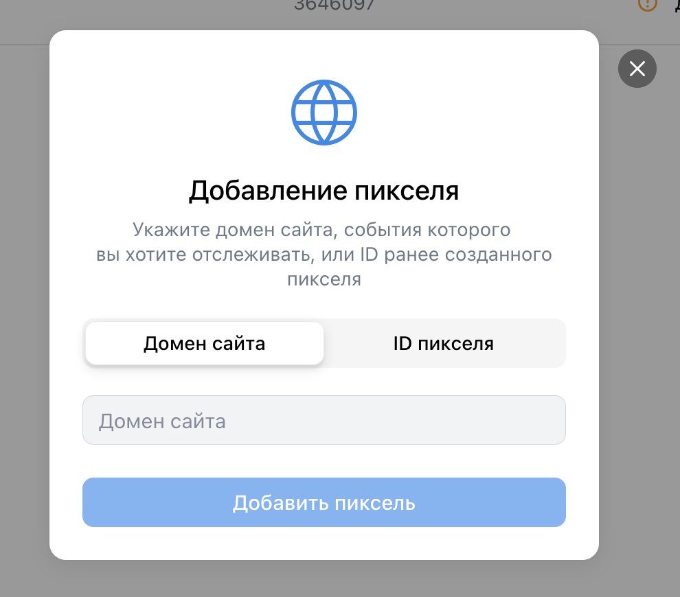

- При вводе в инпут домена строки "фапфпфыпфыпфы" и нажатии на кнопку "Добавить пиксель", возникает ошибка.

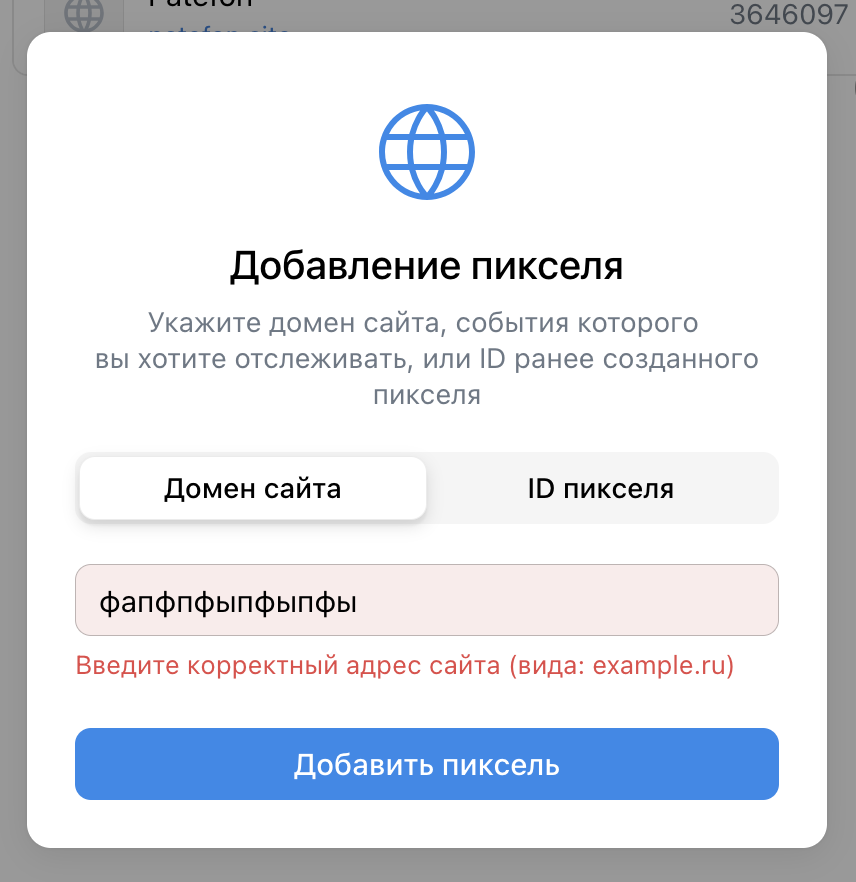

- При вводе в инпут домена строки "patefon.site" и нажатии кнопки "Добавить пиксель", открывается следующее диалоговое окно. Проверить наличие тега "Нашли пиксели, привязанные к сайту".

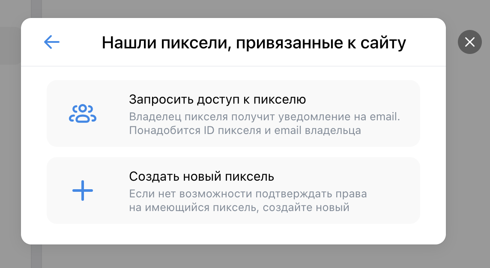

- При нажатии кнопки "Создать новый пиксель", открывается следующее диалоговое окно. Проверить наличие текстового тега "Создан ID пикселя". Сохранить последующий за ним id созданного пикселя в переменную.

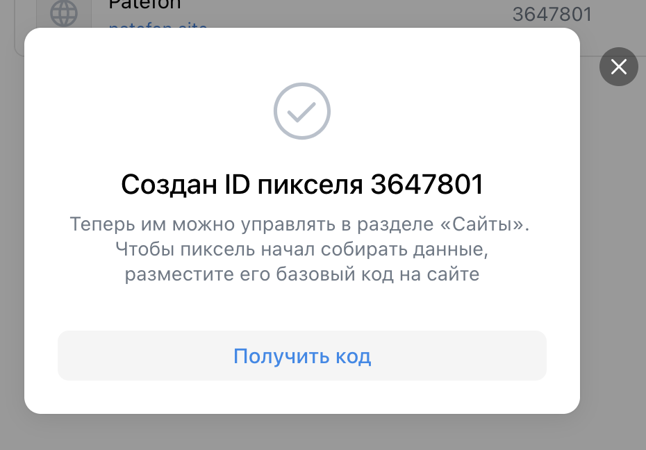

- При нажатии кнопки "Получить код", открывается новая вкладка. Проверить соответствие урла идентификатору созданного пикселя: "https://ads.vk.com/hq/pixels/**{id}**/code"

- Проверить в списке пикселей (урл: https://ads.vk.com/hq/pixels) наличие тегов созданного пикселя: "Patefon", "patefon.site" и его идентификатора.

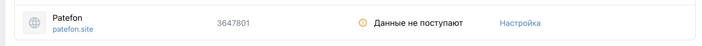

# Аудитории

Ссылка: https://ads.vk.com/hq/audience

## Хедер

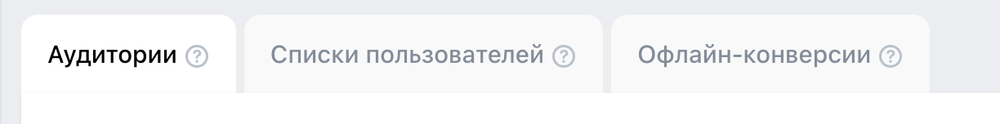

- При нажатии на кнопку "Списки пользователей", происходит переход на другую вкладку. Проверить, что урл совпадает с "https://ads.vk.com/hq/audience/user_lists". Проверить наличие тега "Списков пользователей пока нет".

- При нажатии на кнопку "Офлайн-конверсии", происходит переход на другую вкладку. Проверить, что урл совпадает с "https://ads.vk.com/hq/audience/offline_conversion".

- При нажатии на кнопку "Аудитории", происходит переход на другую вкладку. Проверить, что урл совпадает с "https://ads.vk.com/hq/audience".

## Создание аудитории

`Предварительно создаем пиксель Patefon для сайта patefon.site (описано выше)`

- При нажатии на кнопку "Создать аудиторию" открывается модальное окно. Проверить наличие тега "Создание аудитории".

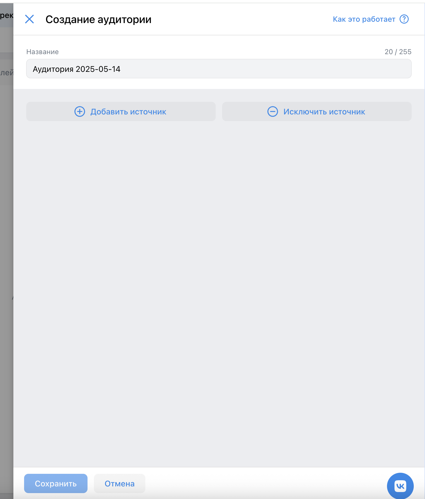

- При нажатии на кнопку "Добавить источник" открывается модальное окно. Проверить наличие тега "Добавить источник".

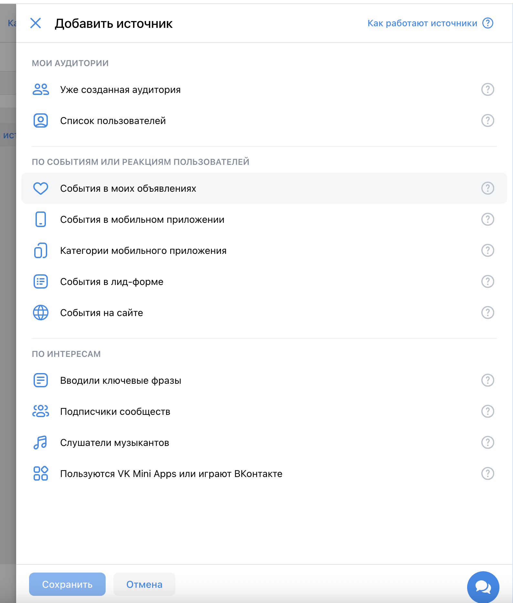

- При нажатии на кнопку "События на сайте" открывается модальное окно. Проверить наличие тега "События на сайте". Проверить наличие "Patefon" в инпуте выбранного пикселя.

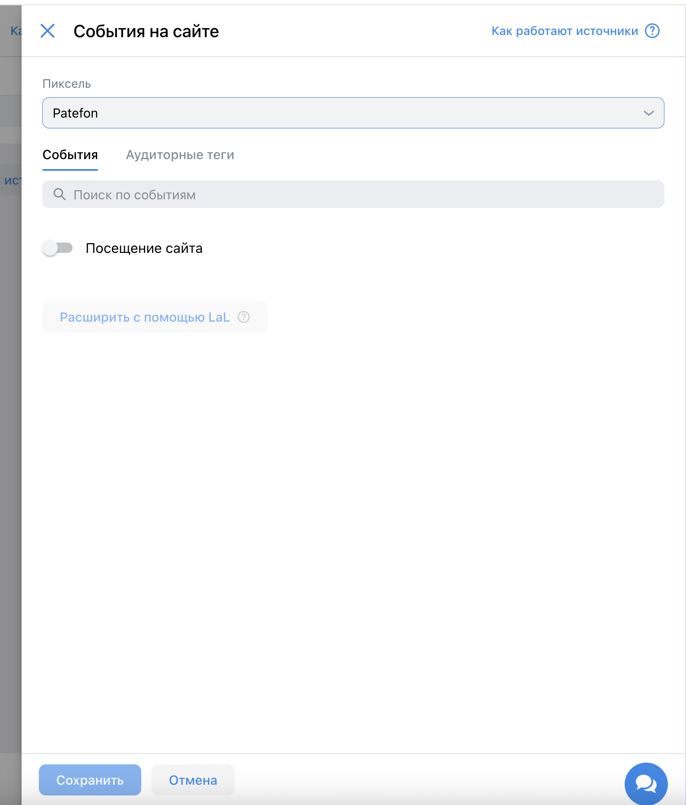

- При нажатии на свитч "Посещение сайта" появляется инпут периода (проверить по наличию тега "дней назад").

- При вводе в инпут периода "от" и "до" 1 и 365, и нажатии кнопки "Сохранить", происходит открывается модальное окно создания аудитории. Проверить наличие тега "Создание аудитории".
  Проверить в созданном событии наличие тегов "Patefon" и "Посещение сайта (1 - 365)".

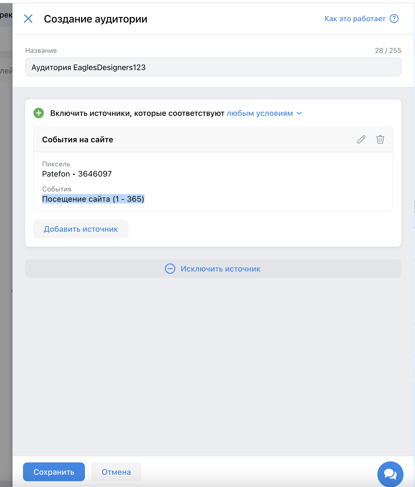

- При вводе в инпут названия аудитории "Аудитория EaglesDesigners123" и нажатии кнопки "Сохранить", модальное окно закрывается. Проверить наличие созданной аудитории "Аудитория EaglesDesigners123".

## Удаление аудитории

- Проверить, что до выделения аудиторий кнопка "Удалить" не кликабельна.

- При выделении чекбокса созданной аудитории "Аудитория EaglesDesigners123" и клике на кнопку "Удалить", появляется диалоговое окно. Проверить наличие тега "Удалить выбранную аудиторию?".

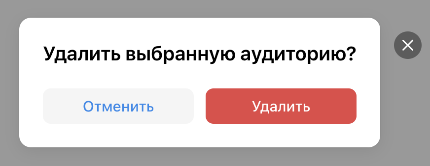

- При нажатии кнокпи "Удалить", диалоговое окно закрывается. Проверить наличие тега "Аудиторий пока нет".

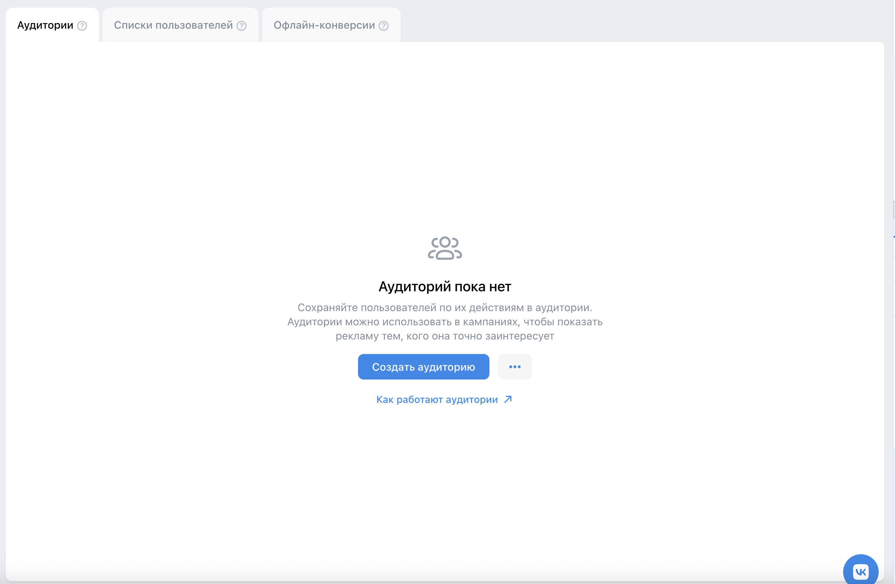

# Мобильные приложения

Ссылка: https://ads.vk.com/hq/apps

## Добавление приложения

- При нажатии на кнопку "Добавить приложение", открывается диалоговое окно. Проверить наличие тега "Привязка приложения".

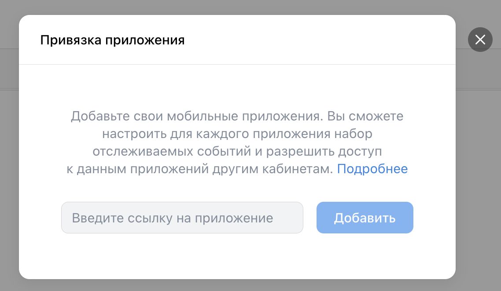

- Проверить, что при пустом инпуте ссылки на приложение, кнопка "Добавить" некликабельна.

- Проверить, что при вводе "abcd.efg" и клике на кнопку "Добавить", появляется ошибка.

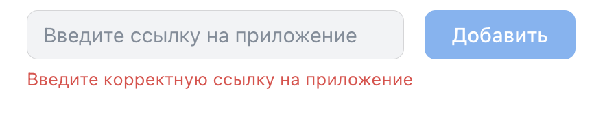

- При вводе "https://apps.apple.com/ru/app/%D0%BC%D0%BE%D0%B9-%D0%BC%D0%B3%D1%82%D1%83/id1641800679" и клике на кнопку "Добавить", открывается следующее диалоговое окно.

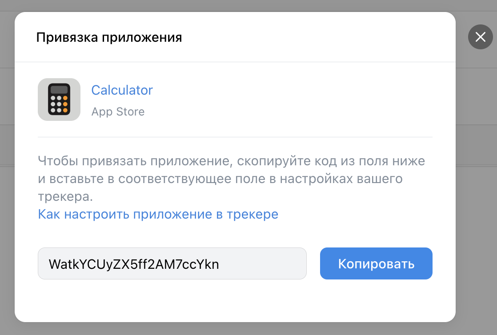

- Проверить, что при клике на кнопку "Копировать", код приложения из поля, помещается в буфер обмена.

- При клике на крестик, диалоговое окно закрывается. Проверить отсутствие тега "Привязка приложения".

- Проверить наличие в нового приложения в списке по тегу "Мой МГТУ".

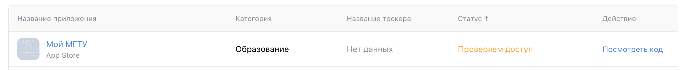

# Обзор

## Создание кампании

расположена на странице https://ads.vk.com/hq/overview

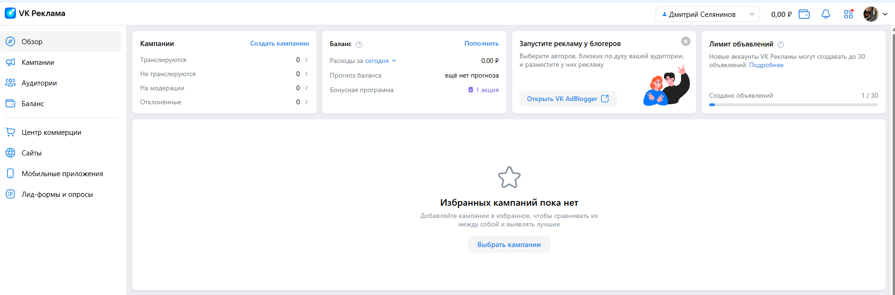

### Настройка кампании

2. Нажатие на кнопку `Создать компанию` внутри контейнера `Кампании` открывает страницу создания компании
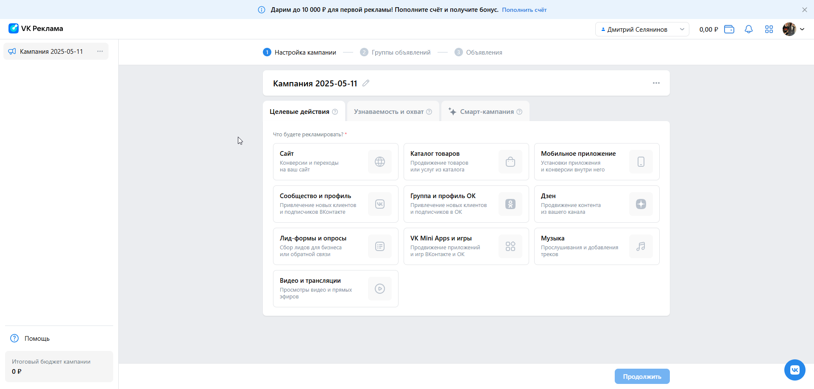

3. Нажатие внутри раздела `Целевые действия` на кнопку `Лид-формы и опросы` раскрывает контейнер `Объект рекламы`
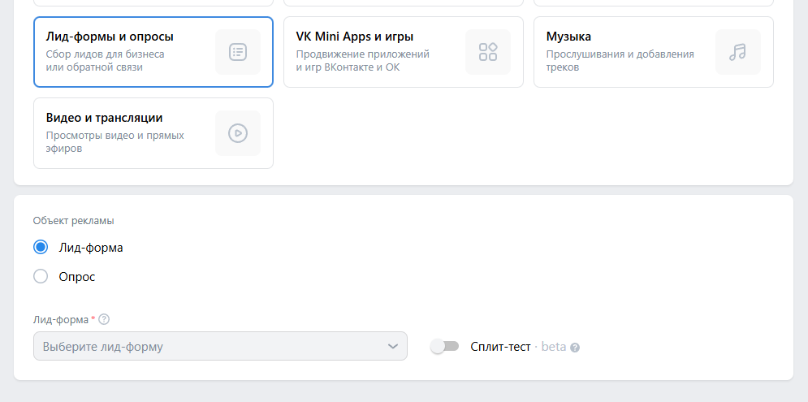

4. Нажатие на раскрывающийся список `Лид-форма` внутри `Объект рекламы` открывает список
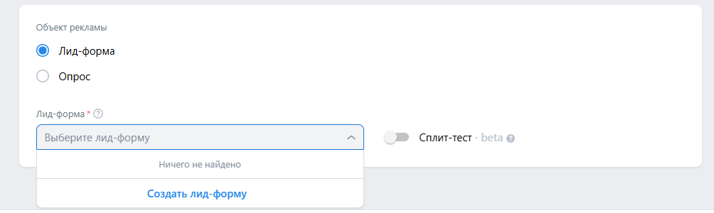

5. Нажатие на `Создать лид-форму` открывает модальное окно `Новая лид-форма`
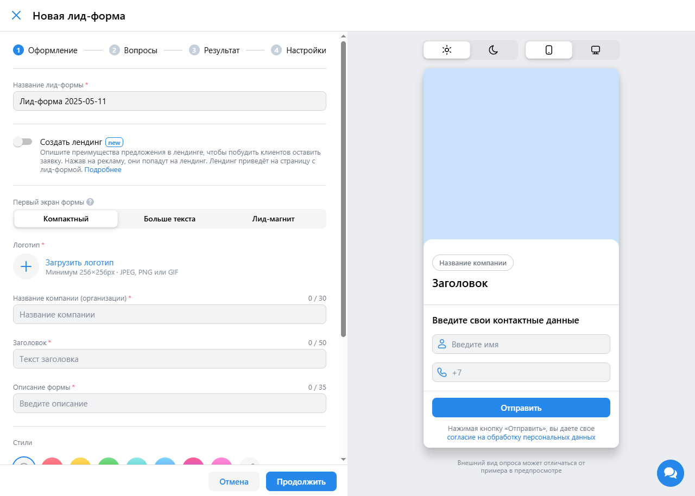

#### Оформление

##### Позитивные кейсы

1. Ввод "название" в поле `Название компании` - ошибок нет
3. Ввод "заголовок" в поле `Заголовок` - ошибок нет
4. Ввод "описание" в поле `Описание формы` - ошибок нет
5. Выбор файла `webp` в качестве логотипа - нет ошибок
6. Выбор файла `jpeg` в качестве логотипа - нет ошибок
7. Выбор файла `png` в качестве логотипа - нет ошибок
8. Выбор файла `jpg` в качестве логотипа - нет ошибок
9. Выбор файла `webp` в качестве обложки - нет ошибок
10. Выбор файла `jpeg` в качестве обложки - нет ошибок
11. Выбор файла `png` в качестве обложки - нет ошибок
12. Выбор файла `jpg` в качестве обложки - нет ошибок

##### Негативные кейсы

1. Ввод 31 символа в поле `Название компании` - ошибка `сократите текст`
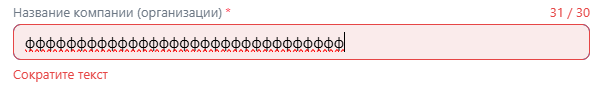
2. Ввод 62 символа в поле `Заголовок` - ошибка `сократите текст`
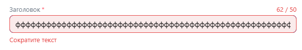
3. Ввод 62 символа в поле `Описание формы` - ошибка `сократите текст`
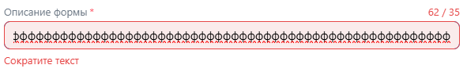
4. Выбор файла `zip` в качестве логотипа - ошибка 
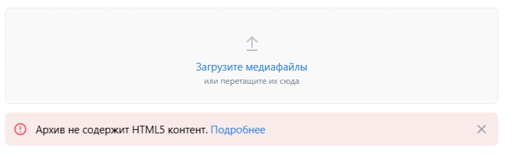
5. Выбор файла `txt` в качестве логотипа - ошибка

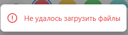

6. Выбор файла `gif` в качестве логотипа - ошибка

7. Выбор файла `zip` в качестве обложки - ошибка 

8. Выбор файла `txt` в качестве обложки - ошибка

9. Выбор файла `gif` в качестве обложки - ошибка

 

#### Вопросы

1. Нажатие кнопки `Продолжить` внутри `Оформление` открывает раздел `Вопросы`
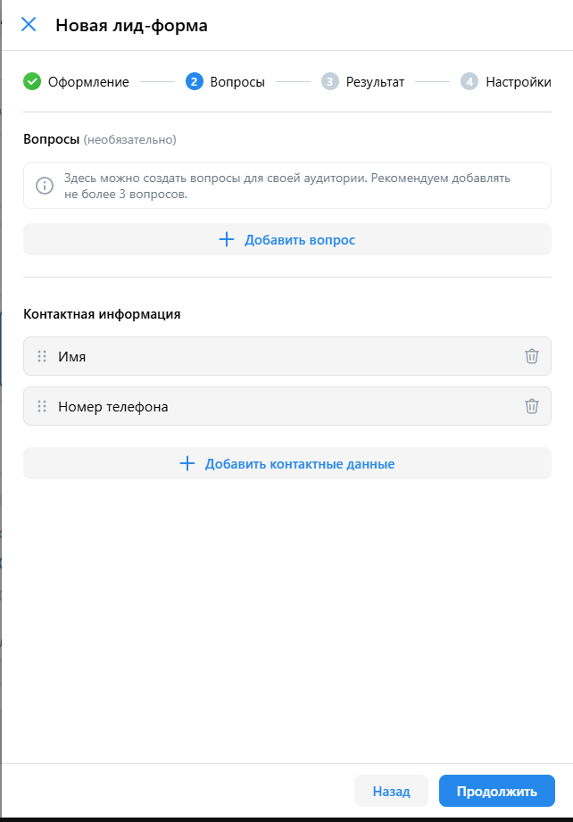

2. Нажатие кнопки `Добавить вопрос` добавляет контейнер `Вопрос`
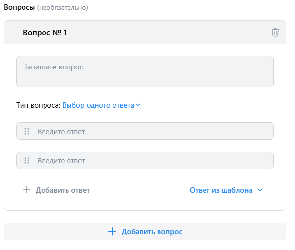
3. Ввод текста в поля `Напишите вопрос` и `Введите ответ` в реальном времени изменяет соответствующие элементы внутри макета
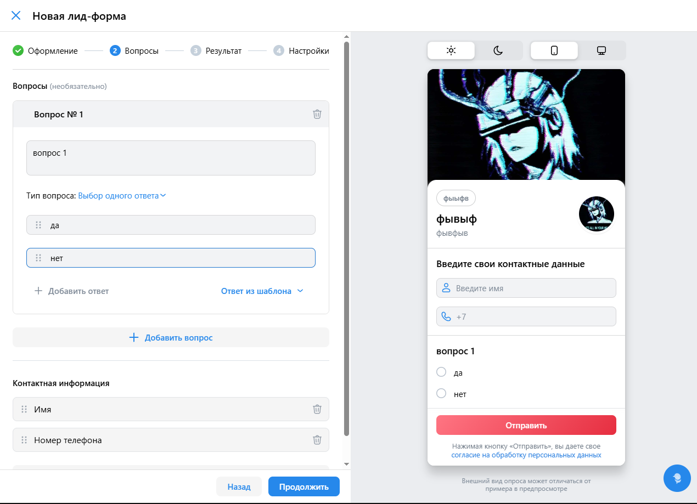
5. Нажатие на кнопку `Добавить ответ` добавляет поле для еще одного вопроса
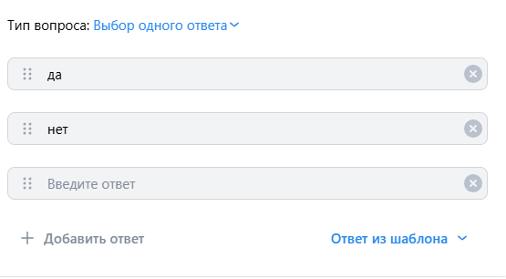
6. Нажатие на кнопку удаления ответа - удаляет ответ

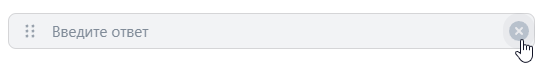

7. Нажатие на кнопку `Добавить контактные данные` открывает модальное окно с выбором информации
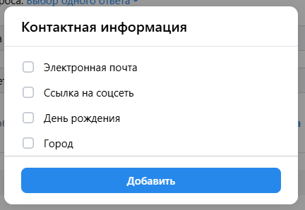
8. Выбор `электронная почта` и нажатие `Добавить` добавляет новый элемент в `Контактная информация`
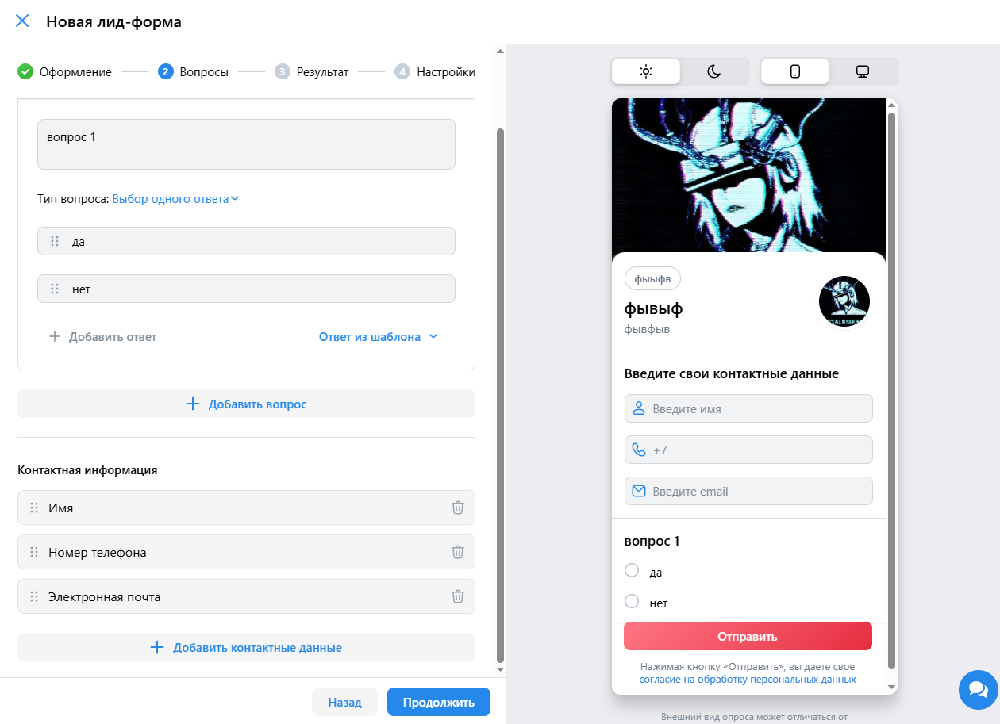 
9. Нажатие на кнопку удаления контактной информации - удаляет элемент
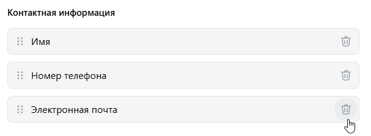

#### Результат

1. Нажатие кнопки `Продолжить` внутри `Вопросы` открывает раздел `Результат`
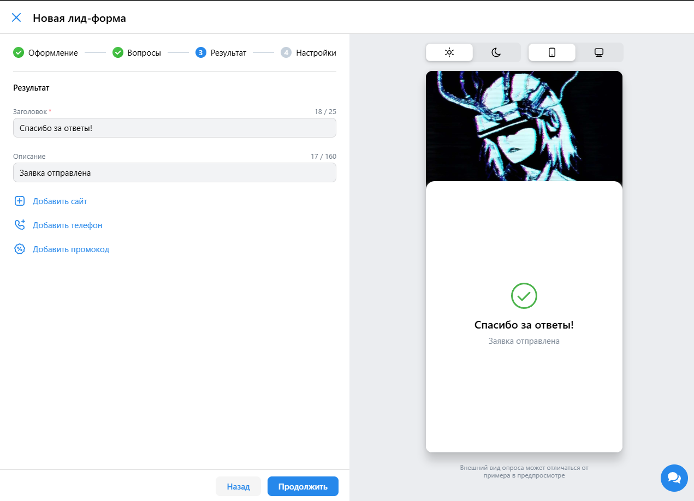

2. Нажатие на кнопки `Добавить ссылку на сайт`, `Добавить телефон` и `Добавить промокод` заменяет кнопки на соответствующие поля ввода
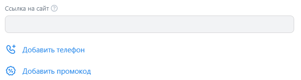

##### Позитивные кейсы
1. Ввод "Спасибо за ответы!" в поле `Заголовок` - ошибок нет
2. Ввод "Заявка отправлена" в поле `Описание` - ошибок нет
3. Ввод "https://patefon.site" в поле `Ссылка на сайт` - ошибок нет
4. Ввод "+78505071905" в поле `Телефон для заказа` - ошибок нет
5. Ввод "промокод" в поле `Промокод` - ошибок нет
##### Негативные кейсы
1. Ввод 26 символов в поле `Заголовок` - ошибка `сократите текст`
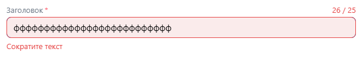
2. Ввод 161 символа в поле `Описание` - ошибка `сократите текст`
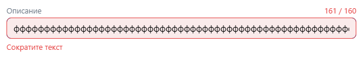
3. Ввод "patefon.site" в поле `Ссылка на сайт` - ошибок `невалидный url`
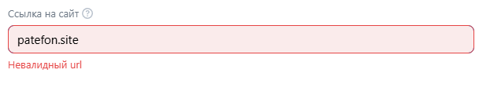
4. Ввод "телефон" в поле `Телефон для заказа` - ошибка `Телефон должен начинаться с + и содержать только цифры`
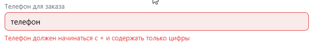
5. Ввод 31 символа в поле `Промокод` - ошибка `сократите текст`
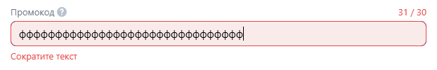

#### Настройки

1. Нажатие кнопки `Продолжить` внутри `Результат` открывает раздел `Настройки`
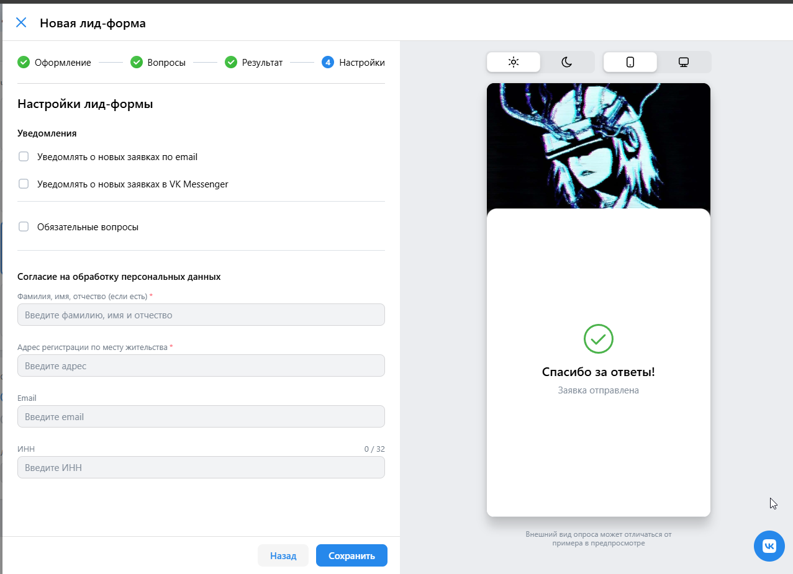

2. Нажатие на чекбокс `Уведомлять о новых заявках по email` добавляет поле ввода почты
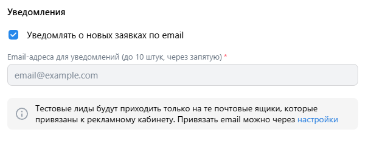
3. Нажатие на чекбокс `Обязательные вопросы` открывает модальное окно подтверждения выбора
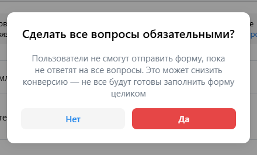

4. Нажатие кнопки `Сохранить` закрывает модальное окно создания лид-формы и добавляет ёё
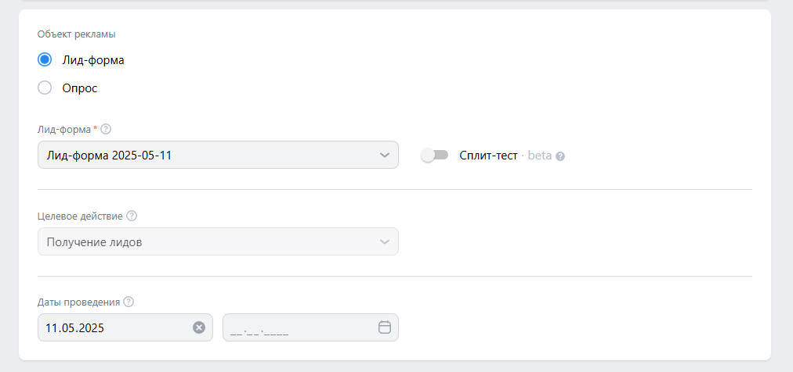

### Продолжение настройки компании

1. Нажатие на поле `Даты проведения` открывает меню с календарем 
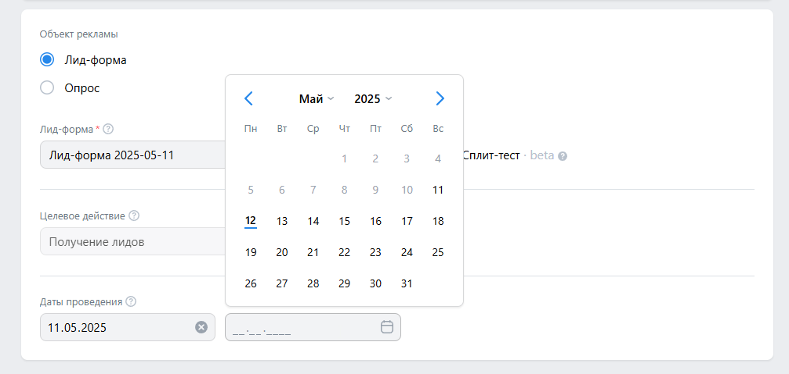
2. Выбранная дата в меню вставляется в поле `Даты проведения`

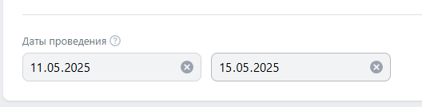

### Группы объявлений 

1. Нажатие на кнопку `Продолжить` в разделе `Настройка кампании` открывает раздел `Группы объявлений`
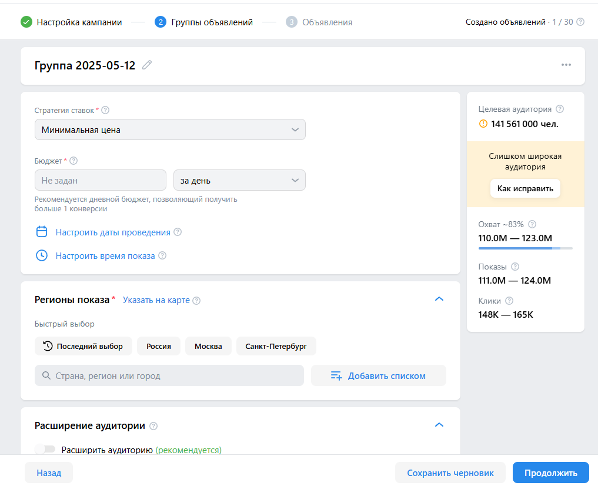

2. Ввод в поле `Регионы показа` отображает подходящие варианты в выпадающем списке, нажатие на вариант добавляет его как выбран
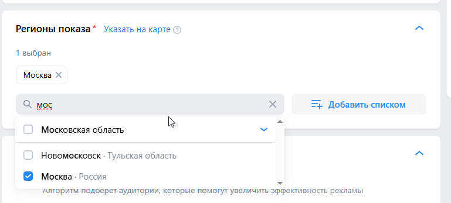

### Объявления

1. Нажатие на кнопку `Продолжить` в разделе `Группы объявлений` открывает раздел `Объявления` при заполнении обязательных полей (`Стратегия ставок`: Минимальная цена, `Бюджет`: 1000, `Регионы показа`: Москва)
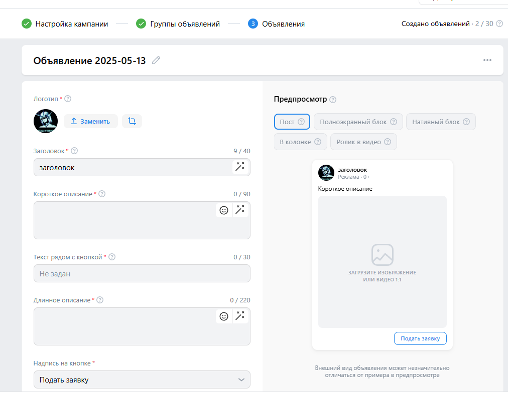

##### Негативные кейсы
1. Ввод 41 символа в поле `Заголовок` - ошибка `сократите текст`

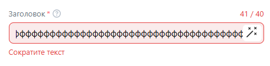

2. Ввод 91 символа в поле `Короткое описание` - ошибка `сократите текст`

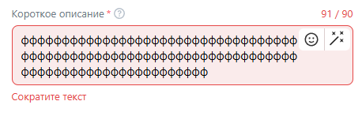

3. Ввод 31 символа в поле `Текст рядом с кнопкой` - ошибка `сократите текст`

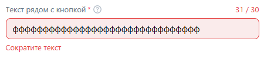

4. Ввод 221 символа в поле `Длинное описание` - ошибка `сократите текст`

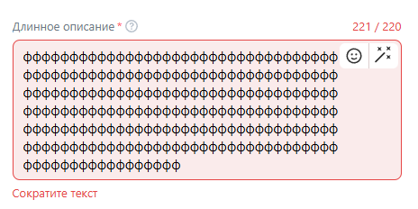

5. Отсутствие ввода в поле `Заголовок` - ошибка `Нужно заполнить`

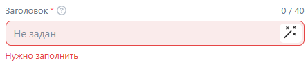

6. Отсутствие ввода в поле `Короткое описание` - ошибка `Нужно заполнить`

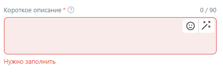

7. Отсутствие ввода в поле `Текст рядом с кнопкой` - ошибка `Нужно заполнить`

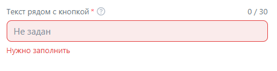

8. Отсутствие ввода в поле `Длинное описание` - ошибка `Нужно заполнить`

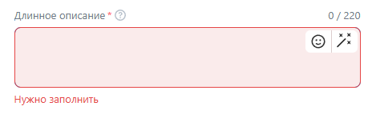

##### Позитивные кейсы

1. Ввод "заголовок" в поле `Заголовок` - ошибок нет

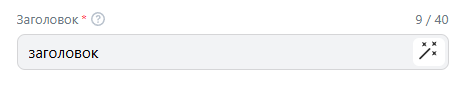

2. Ввод "описание" в поле `Короткое описание` - ошибок нет

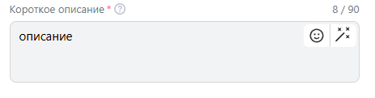

3. Ввод "текст" в поле `Текст рядом с кнопкой` - ошибок нет

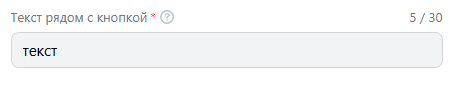

4. Ввод "описание" в поле `Длинное описание` - ошибок нет

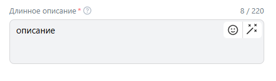

5. Выбор в выпадающем меню `Надпись на кнопку` "Подать заявку" - ошибок нет

### Завершение создания кампании

1. Нажатие кнопки `Опубликовать` создает кампанию и переадресует на https://ads.vk.com/hq/overview
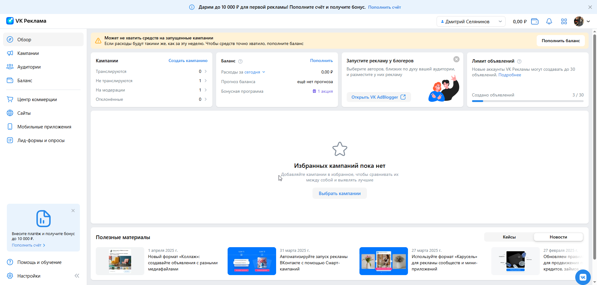

### Удаление кампании

1. Нажатие кнопки `Не транслируются` в контейнере `Кампании` открывает страницу с созданными кампаниями
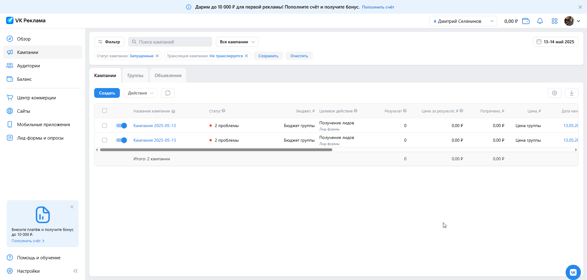

2. Нажатие на чекбокс по кампании и выбор в качестве действия `удалить` - удаляет кампанию
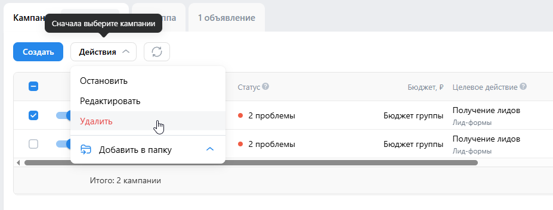